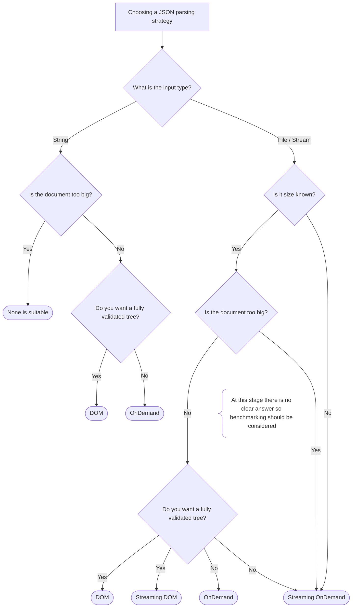

# zimdjson

A Zig version of [simdjson](https://github.com/simdjson/simdjson), a JSON parser using SIMD instructions, based on the paper [Parsing Gigabytes of JSON per Second](https://arxiv.org/abs/1902.08318) by Geoff Langdale and Daniel Lemire.

## Features

`zimdjson` covers the basic features `simdjson` provides like a DOM/OnDemand parser plus some that are, at the time being, unsolved:

- [No padding requirement.](https://github.com/simdjson/simdjson/issues/174)
- [No 4GB document limit on streaming.](https://github.com/simdjson/simdjson/issues/670)

## Future work

- Reflection (Zig provides compile-time reflection but I will wait until there is a decision about this [proposal](https://github.com/ziglang/zig/issues/1099) to prevent wasted work).
- Runtime CPU Detection (this [proposal](https://github.com/ziglang/zig/issues/1018) must be resolved first).
- Multithreading on streaming.
